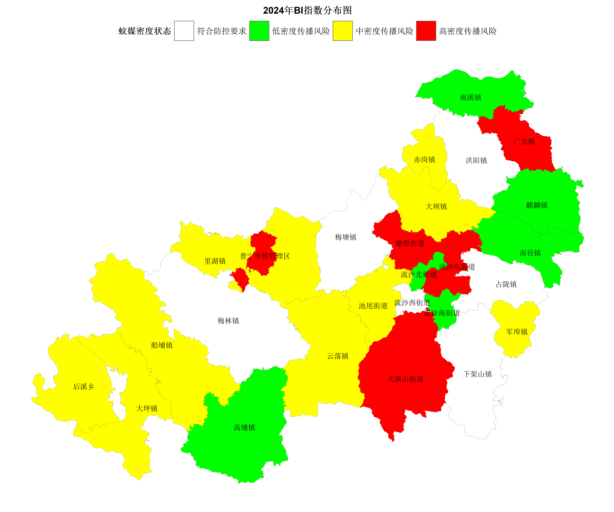

```{r setup, include=FALSE}
knitr::opts_chunk$set(echo = FALSE)
year <- format(Sys.Date(), "%Y")
window_report <- "6月下半月" #报告窗口；与标题YAML中的title一致
```

## 一、主要做法

  从3月份开始，全市各地每月开展媒介伊蚊幼虫密度常规监测2次，媒介伊蚊成蚊密度常规监测1次。监测场所包括居民区和非居民区（公园、工地、机团单位等），监测项目包括幼虫密度（布雷图指数法BI）和成蚊密度(诱蚊诱卵器法MOI)，以高密度（BI或MOI\>20）、中密度（10\<BI≤20或10\<MOI≤20）、低密度（5\<BI≤10或5\<MOI≤10）、符合防控要求（BI≤5,MOI≤5）作为风险评估依据

## 二、伊蚊密度监测结果

```{r message=FALSE, warning=FALSE, include=FALSE}
source("code/data_analysis.R")
# source("code/figure.R")
```

  `r year` 年`r month`全市伊蚊密度监测风险评估统计表见表1、表2、表3、表4。

## 三、分析评估

### （一）全市监测概况

<!-- &emsp;&emsp;**蚊媒监测情况：**`r month` 全市蚊媒监测数据（布雷图指数BI）显示：全市各乡镇（街道、场）共`r total_bi_sites`个BI监测点，其中：BI为高密度传播风险的有`r high_risk_sites`个点，占`r high_risk_percentage`%，BI为中密度传播风险的有`r medium_risk_sites`个点，占`r medium_risk_percentage`%。低密度传播风险的有`r low_risk_sites`个点，占`r low_risk_percentage`%。符合防控要求的有`r compliant_sites`个点，占`r compliant_percentage`%。详见表1。 -->

  **蚊媒监测情况：**：`r year`年`r   month`，共调查`r total_households`户，发现媒介伊蚊阳性容器及水体`r positive_stagnant_water`处，平均布雷图指数（BI）为`r bi_index`，`r Bi_high_low_last_month`于上月水平（`r Bi_last_month`），`r Bi_high_low_5`于登革热传播风险阈值 （5）。各月BI指数见图1。


  在全市 `r total_bi_sites`个BI监测点中，BI为高密度传播风险的有`r high_risk_sites`个点，占`r high_risk_percentage`%；BI为中密度传播风险的有 `r medium_risk_sites` 个点，占`r medium_risk_percentage`%；低密度传播风险的有`r low_risk_sites`个点，占`r  low_risk_percentage`%。符合防控要求的有`r compliant_sites`个点，占`r compliant_percentage`%。详见图2和表2。



### （二）各监测点情况

  1、**布雷图指数（BI）常规监测：**`r year`年`r month`月我市蚊媒高密度传播风险的有`r high_risk_sites`个点`r high_risk_name`。中密度传播风险的有`r medium_risk_sites`个点`r medium_risk_name`。低密度传播风险的有`r low_risk_sites`个点`r low_risk_name`。详见表3。

  2、**成蚊密度（MOI）常规监测：**`r year`年`r month`我市共有`r nmoi`个MOI监测点：`r moi_all_risk_name`，诱蚊诱卵指数为`r moi_all_risk_moi`，为`r moi_risk_summary`。详见表4。

## 四、工作建议

  1、近期高温高湿的气候为蚊虫的繁殖提供非常适宜的环境，各地要严格按照《广东省登革热防控专业技术指南（2015年版）》、《广东省登革热等蚊媒传染病监测方案（2019年版）》、《广东省疾病预防控制中心关于广东省 2024 年病媒生物监测工作实施要求的通知》（粤疾控函〔2024〕201 号）等部署要求，及早部署登革热防控工作，强化以清除孳生地为主，以杀灭成蚊为辅的爱国卫生运动，彻底消除伊蚊幼虫孳生地。

  2、各地必须加强蚊媒监测力度，完善监测覆盖面，提高监测质量，做到选点精准，数据准确，督促蚊媒中密度监测点（以监测点为中心周边200-400米范围内）强化以清除孳生地为主，以杀灭成蚊为辅的灭蚊工作。

  3、重点管理好下列几类场所：工地、石料厂、废墟、废旧物资收购站、居民区/平房区、菜园（地）。各地职能部门要加强对各重点场所的防蚊、灭蚊工作。

  4、重点管理好下列几类容器：居民区/平房区室内外闲置容器、水生盆栽和贮水容器、废旧轮胎。闲置容器需及时清理或倒扣放置避免积水；水生盆栽和贮水容器需定期（每3天1次）换水和清洗内壁；倡导采用防蚊装置的瓶水培植物或砂土盆栽植物；贮水容器需加盖，防止蚊虫产卵；废旧轮胎采用砂土填埋。

  5、多角度、多渠道普及登革热防控知识，增强群众防蚊灭蚊、预防疾病的意识，真正做到人人动手，整治环境，翻盆倒罐，清除积水和消灭蚊虫，形成群防群控的良好氛围。

\newpage

## **表1 普宁市`r month`蚊媒密度状态情况表**

```{r}
# 使用 knitr::kable() 函数来生成Markdown格式的表格
kable(status_counts,format = "markdown",escape = FALSE)
```

## **表2 普宁市`r month`布雷图指数监测情况汇总表**

```{r}
# 使用 knitr::kable() 函数来生成Markdown格式的表格
kable(summary_data,format = "markdown",escape = FALSE)
```

## **表3 普宁市疾控中心`r month`BI监测点监测情况一览表**

```{r}
# 使用 knitr::kable() 函数来生成Markdown格式的表格
knitr::kable(month_data_cdc, format = "markdown")
```

\newpage

## **普宁市各乡（镇、街道、场）`r month`常规监测情况表**

```{r}
# 使用 knitr::kable() 函数来生成Markdown格式的表格
knitr::kable(month_data_other,format ="markdown")
```

\newpage

## **表4 普宁市疾控中心`r year`年`r month`MOI监测情况统计表**

```{r}
# 使用 knitr::kable() 函数来生成Markdown格式的表格
knitr::kable(data_moi, format = "markdown")
```
